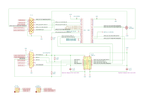
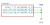
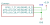
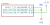

Logitech® Z906 Surround Sound Speakers
======================================

Overview
--------

PCBs for an alternative console and simulated amplifier interface for the
ESP32-S3 microcontroller interacting with Logitech® Z906 Surround Sound
Speakers.

    Glod picked up his horn. Cliff sat down and found his hammers. Buddy walked
    to the centre of the stage and, to Cliff's amazement, just stood there
    looking down at his feet.

    The cheering began to subside. And then it died away altogether. The huge
    hall was filled with the hush of hundreds of people holding their breath.

    Buddy's fingers moved. He picked out three simple little chords. And then he
    looked up.

    "Hello, Ankh-Morpork!"

    Cliff felt the music rise up behind him and rush him forward into a tunnel
    of fire and sparks and excitement. He brought his hammers down. And it was
    Music With Rocks In.

    -- `Terry Pratchett <https://en.wikipedia.org/wiki/Terry_Pratchett>`_
    (`Soul Music, 1994 <https://en.wikipedia.org/wiki/Soul_Music_(novel)>`_)

Purpose
-------

Provide an unofficial alternative console (to control the amplifier directly
without the original console) and simulated amplifier interface (to indirectly
control an amplifier with the original console).

Usage
-----

This project is made up of 3 KiCad projects, each of which share the same common
schematic file. These projects depend on support for symbolic links (which
can be enabled in Developer Mode if you're using Windows).

Schematic
---------

Common schematic shared by all PCBs. Components with an "A-" (amplifier)
reference are for the amplifier/bridge PCBs, components with a "C-" (console)
reference are for the console/bridge PCBs and components with an "S-" (single
DE-15 socket) reference are for the amplifier/console PCBs.

Amplifier PCB
~~~~~~~~~~~~~

Connect to an amplifier on its own to control the amplifier and access the Aux
Input and Headphones audio through `3.5mm TRS sockets <https://en.wikipedia.org/wiki/Phone_connector_(audio)>`_.

Console PCB
~~~~~~~~~~~

Connect to a console on its own to control the console and access the Aux Input
and Headphones audio through `3.5mm TRS sockets <https://en.wikipedia.org/wiki/Phone_connector_(audio)>`_.

Bridge PCB
~~~~~~~~~~

Connect between an amplifier and a console to control both devices
independently.

Components
----------

+-------+--------------------------------------------------------+--------------------+
| Ref   | Name                                                   | PCB                |
+=======+========================================================+====================+
|       | ESP32-S3 Development Board                             | all                |
+-------+--------------------------------------------------------+--------------------+
| S3L1  | 1x20 Pin Socket, Through Hole (2.54mm)                 | all                |
+-------+--------------------------------------------------------+--------------------+
| S3R1  | 1x20 Pin Socket, Through Hole (2.54mm)                 | all                |
+-------+--------------------------------------------------------+--------------------+
| A-C1  | 0.1µF Capacitor, SMD 0805 (Metric 2012)                | amplifier, bridge  |
+-------+--------------------------------------------------------+--------------------+
| A-C2  | 0.1µF Capacitor, SMD 0805 (Metric 2012)                | amplifier, bridge  |
+-------+--------------------------------------------------------+--------------------+
| A-J1  | Amphenol L77HDE15SD1CH4R DE-15 socket                  | amplifier, bridge  |
+-------+--------------------------------------------------------+--------------------+
| A-R1  | 1kΩ Resistor, SMD 0805 (Metric 2012)                   | amplifier, bridge  |
+-------+--------------------------------------------------------+--------------------+
| A-R2  | 10kΩ Resistor, SMD 0805 (Metric 2012)                  | amplifier, bridge  |
+-------+--------------------------------------------------------+--------------------+
| A-R3  | 10kΩ Resistor, SMD 0805 (Metric 2012)                  | amplifier, bridge  |
+-------+--------------------------------------------------------+--------------------+
| A-U1  | Texas Instruments ISO6742DWR Digital Isolator, SOIC-16 | amplifier, bridge  |
+-------+--------------------------------------------------------+--------------------+
| C-J1  | Amphenol L717HDE15PD1CH4F DE-15 plug                   | console, bridge    |
+-------+--------------------------------------------------------+--------------------+
| C-Q1  | Diodes DMP2004K P-Channel MOSFET, SOT-23               | console, bridge    |
+-------+--------------------------------------------------------+--------------------+
| S-J1  | Same Sky SJ1-3523N 3.5mm Audio Jack                    | amplifier, console |
+-------+--------------------------------------------------------+--------------------+
| S-J2  | Same Sky SJ1-3523N 3.5mm Audio Jack                    | amplifier, console |
+-------+--------------------------------------------------------+--------------------+

Supported ESP32-S3 Boards
-------------------------

* LOLIN WEMOS S3
* Espressif ESP32-S3-DevKitC-1
* Espressif ESP32-S3-DevKitM-1

Amplifier Signals GPIOs
~~~~~~~~~~~~~~~~~~~~~~~

"Amplifier Power In" should only be pulled down, to avoid back-powering the
amplifier microcontroller when mains power is off.

When "Amplifier Power In" is active, the amplifier has mains power. Enable
"Console Announce" to turn the amplifier on, and disable it turn the amplifier
off. Don't leave it on constantly because it will heat up and waste power.
Automatic standby can be implemented by
`reading the idle time <https://github.com/nomis/logitech-z906/blob/main/protocol.rst#read-idle-time>`_.

When "Amplifier Detect" is active, the amplifier is ready to communicate over
the 3.3V UART. The labels "Amplifier RX" and "Amplifier TX" are from the
perspective of the amplifier.

+------------------------+-------+---------+-----------+-----------+----------+----------+
| Name                   |  Pin  |  LOLIN  |  DevKitC  |  DevKitM  |  Socket  |  Active  |
+========================+=======+=========+===========+===========+==========+==========+
| Amplifier Power In     |   11  |    8    |     8     |    10     |   L 12   |   High   |
+------------------------+-------+---------+-----------+-----------+----------+----------+
| Console Announce       |   15  |   41    |    41     |    42     |   R  7   |   Low    |
+------------------------+-------+---------+-----------+-----------+----------+----------+
| Amplifier Detect       |    8  |   21    |    21     |    21     |   R 15   |   Low    |
+------------------------+-------+---------+-----------+-----------+----------+----------+
| Amplifier RX           |   13  |   10    |    10     |    14     |   L 16   |          |
+------------------------+-------+---------+-----------+-----------+----------+----------+
| Amplifier TX           |   12  |    9    |     9     |    13     |   L 15   |          |
+------------------------+-------+---------+-----------+-----------+----------+----------+
| 3.3V                   |       |         |           |           |   L  1   |          |
+------------------------+-------+---------+-----------+-----------+----------+----------+
| GND                    |    6  |         |           |           |   R  1   |          |
+------------------------+-------+---------+-----------+-----------+----------+----------+

Console Signals GPIOs
~~~~~~~~~~~~~~~~~~~~~

Prepare all other GPIOs and UARTs before applying console power, otherwise it
will report a communication error.

Enable "Console Power out" to power the console on, and disable it to power off
the console. Without a `firmware modification to the console <https://github.com/nomis/logitech-z906/blob/main/firmware.rst#automatic-power-on>`_,
user intervention will be required to turn the console on after it's powered.

When "Amplifier Announce" is active, the amplifier indicates that it is ready to
communicate over the 3.3V UART. The labels "Console RX" and "Console TX" are
from the perspective of the console.

+------------------------+-------+---------+-----------+-----------+----------+----------+
| Name                   |  Pin  |  LOLIN  |  DevKitC  |  DevKitM  |  Socket  |  Active  |
+========================+=======+=========+===========+===========+==========+==========+
| Console Power Out      |   11  |   40    |    40     |    41     |   R  8   |   Low    |
+------------------------+-------+---------+-----------+-----------+----------+----------+
| Console RX             |   12  |    4    |     4     |     2     |   L  4   |          |
+------------------------+-------+---------+-----------+-----------+----------+----------+
| Console TX             |   13  |    6    |     6     |     4     |   L  6   |          |
+------------------------+-------+---------+-----------+-----------+----------+----------+
| Amplifier Announce     |    8  |   13    |    47     |    26     |   R 17   |   Low    |
+------------------------+-------+---------+-----------+-----------+----------+----------+
| Console Detect         |   15  |   17    |    17     |     8     |   L 10   |   Low    |
+------------------------+-------+---------+-----------+-----------+----------+----------+
| 3.3V                   |       |         |           |           |   L  1   |          |
+------------------------+-------+---------+-----------+-----------+----------+----------+
| GND                    |    6  |         |           |           |   R  1   |          |
+------------------------+-------+---------+-----------+-----------+----------+----------+

Board ID GPIOs
~~~~~~~~~~~~~~

To identify which type of PCB the ESP32-S3 has been connected to, read the
big-endian value of these GPIOs.

+-------+---------+-----------+-----------+
|  Bit  |  LOLIN  |  DevKitC  |  DevKitM  |
+=======+=========+===========+===========+
|   2   |    7    |     7     |     5     |
+-------+---------+-----------+-----------+
|   1   |   15    |    15     |     6     |
+-------+---------+-----------+-----------+
|   0   |   16    |    16     |     7     |
+-------+---------+-----------+-----------+

+---------+-----------+
| Value   | PCB       |
+=========+===========+
| 000 (0) | Amplifier |
+---------+-----------+
| 001 (1) | Bridge    |
+---------+-----------+
| 010 (2) | Console   |
+---------+-----------+

Related Documentation
---------------------

* `Console firmware/interface/protocol <https://github.com/nomis/logitech-z906>`_

Related Software
----------------

* `Software to interact with the console/amplifier <https://github.com/nomis/ggroohauga>`_

Notices
-------

"Logitech" is a trademark of `Logitech International SA <https://www.logitech.com/>`_.
